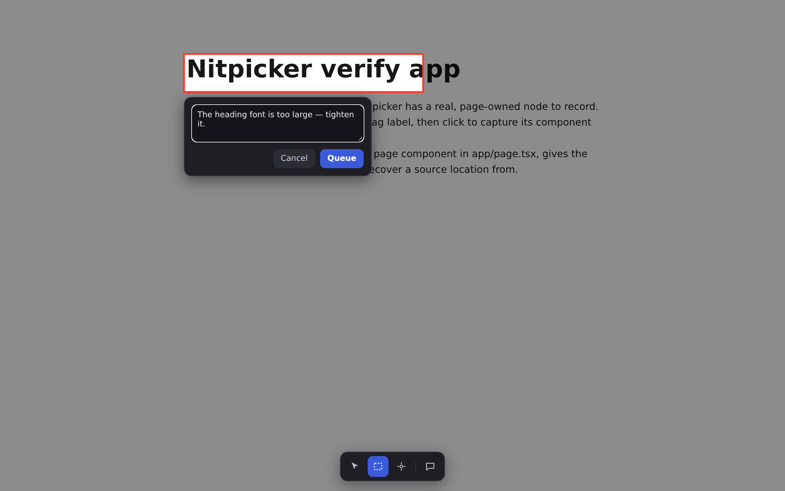
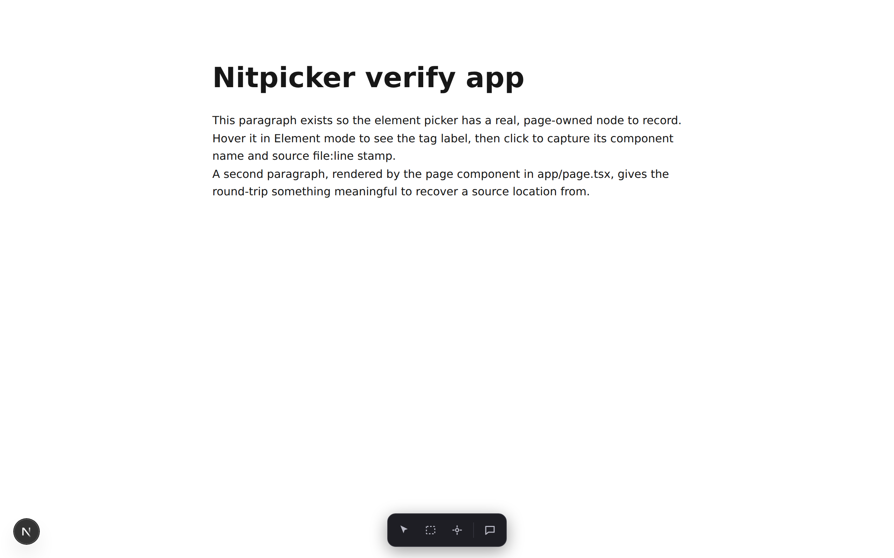
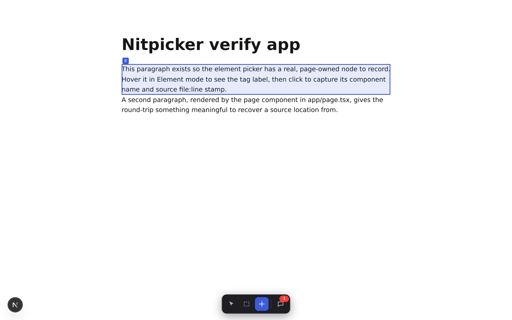
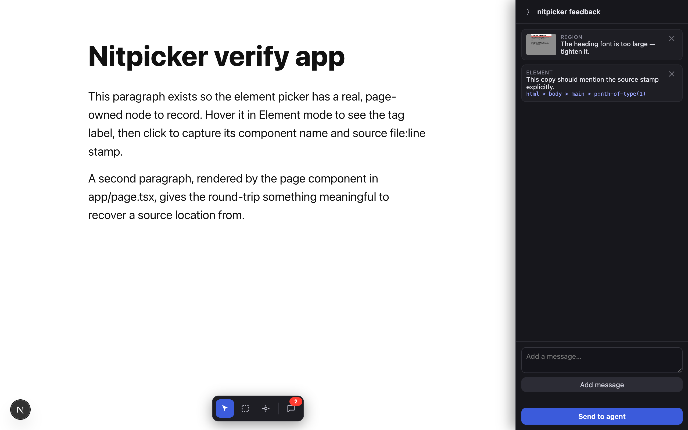

# nitpicker

[](./LICENSE)
[](https://github.com/ege2734/nitpicker/actions/workflows/ci.yml)


**An installable Claude Code skill that drops an in-app dev-feedback overlay into any React/Next repo.**

nitpicker lets you visually mark up your running app and batch-send that feedback straight to the AI
coding session that built it.
A dev-only dock offers three modes:

- **Cursor** — passive; the app is fully interactive.
- **Region** — drag a box (think MacOS Cmd+Shft+4); the viewport freezes, dims gray except your selection, and a **red box is
  composited onto a screenshot**. The AI session receives a local PNG path with the box already burned in.
  Press **`⌘/Ctrl+Shift+X`** to jump straight into Region mode and **freeze the viewport at that instant** —
  the only way to screenshot **hover-only UI** (chart hover-cards, tooltips, menus that vanish the moment you
  reach for the dock), because the snapshot preserves whatever was hovered when you pressed the key.
- **Element** — hover to outline, click to record. The AI session receives an **agent-grade descriptor**:
  the React component name, the source `file:line:col`, a stable CSS selector, testid, text, and route.

A **docked** feedback pane on the right (it reserves its width, so the app reflows beside it rather than
being covered) queues the marks, lets you add freeform messages, and sends the whole batch to a local
**sidecar** the AI session long-polls. Everything is **dev-only** — `NODE_ENV`-gated, tree-shaken from
`next build`, and never imported by the app in production.

<p align="center">
  
  <br>
  <em>Region mode — drag a box; the viewport freezes and dims, a red box is composited onto the screenshot,
  and the AI session receives the local PNG with the box already burned in.</em>
</p>

## Quickstart

nitpicker is a **Claude Code skill**. Your coding agent installs the overlay into your app and consumes
the feedback for you — you just point and click.

**1. Install the skill** (once)

```bash
npx github:ege2734/nitpicker           # → ./.claude/skills/nitpicker   (this project)
npx github:ege2734/nitpicker --user    # → ~/.claude/skills/nitpicker   (all your projects)
```

Restart Claude Code (or start a new session) and the **`/nitpicker`** skill is available. (Prefer not to run
`npx`? Clone the repo into a `.claude/skills/nitpicker` folder by hand — same result.)

**2. Set it up in your project.** From your React/Next repo, run **`/nitpicker`** (or just ask your agent
to *"set up nitpicker"*). It copies the assets, adds the dev-dependencies, mounts the overlay dev-only,
wires the source-stamp transform into `next.config`, and starts the three background processes — the
sidecar, your dev server, and its own feedback long-poll.

**3. Mark up your app.** Open it in the browser; a dock sits bottom-center:

- **Region** — drag a box on the live page (instant), type a note, **Queue** → a red box is burned onto a
  screenshot of your selection. Or press **`⌘/Ctrl+Shift+X`** to enter Region mode with the viewport frozen
  at that instant — the way to capture **hover-only UI** (tooltips, chart hover-cards) that a trip to the
  dock would dismiss.
- **Element** — click a node → captures its React component, source `file:line`, and a stable selector.
- **Message** — plain freeform text.

The feedback pane is **docked** to the right, reserving its width so the app reflows beside it (never
covered); screenshots only ever capture the app area, never the pane, and the red box frames exactly what
you dragged. Each **Queue** appends the mark to the pane's list, ticks the dock's badge, and drops you back
to Cursor — the page stays fully interactive; the region screenshot rasterizes in the background at that
moment (a drag you cancel captures nothing). **Click a queued item** to view its screenshot and edit its
message. Hide the pane with its top-left **⟩** toggle (the app expands to full width) and re-show it from
the dock. Queue as many as you like, then hit **Send to agent**. The coding session that built your app
receives the whole batch — screenshots with the box burned in, precise source locations — and gets to work.
Nothing to
copy, paste, or describe.

## Demo

<table>
  <tr>
    <td width="50%"></td>
    <td width="50%"></td>
  </tr>
  <tr>
    <td><strong>The dev-only dock</strong> — cursor · region · element · feedback queue. Only one mode is active at a time; <code>Esc</code> returns to cursor, and <code>⌘/Ctrl+Shift+X</code> jumps into Region mode with the viewport frozen (to catch hover-only UI). Queuing a mark ticks the badge and snaps back to cursor; it lands in the docked feedback pane (toggle it with the pane's ⟩ button or the dock's feedback-queue button).</td>
    <td><strong>Element mode</strong> — hover to outline a node (tag/testid label); click records its React component, source <code>file:line:col</code>, and a stable selector.</td>
  </tr>
</table>

<p align="center">
  
  <br>
  <em>The feedback queue batches your marks — here a region screenshot and an element pick (note the recovered
  CSS selector) — then <strong>Send to agent</strong> POSTs the whole batch to the sidecar your AI session long-polls.</em>
</p>

## Supported frameworks

nitpicker has one **fully verified** target and degrades predictably elsewhere:

| Target | Overlay + sidecar (region / message) | Element picker: React component name | Element picker: `file:line:col` source |
| --- | :---: | :---: | :---: |
| **Next.js App Router · React 18/19** (verified) | ✅ | ✅ (runtime fiber walk) | ✅ (build-time `data-nitpicker-source` stamp) |
| Next.js Pages Router | ✅ | ✅ | ✅ once the loader is wired for your JSX files |
| React + Vite / CRA (no Next) | ✅ | ✅ | ⚠️ no stamp — falls back to selector + testid + text + route |
| Non-React app in an iframe | ⚠️ anticipated (iframe-harness adapter, **not shipped**) | — | — |

The overlay itself (`@nitpicker/core`) is framework-agnostic shadow-DOM TypeScript with **no React import**;
only the `data-nitpicker-source` stamp is Next-specific (it rides Next's Turbopack/webpack loader hooks).
On a non-Next stack you still get region screenshots, messages, component names, and a stable selector —
just not the exact source line. The one seam a new host plugs into is `resolveElement`; this repo ships
the Next/React adapter.

## Prod-safety & guardrails

nitpicker must **never** reach production. Nothing here is a security control — it's dev tooling — but
there are layered guardrails so a misconfigured install fails safe rather than shipping the overlay:

**Primary gates (keep everything out of the prod bundle):**
- The overlay is mounted only behind `process.env.NODE_ENV !== "production"`, and the dynamic
  `import("../core")` sits inside the **same static block**, so `next build` folds the branch to
  `if (false)` and drops the async chunk — core **and** html2canvas — from the bundle.
- The `data-nitpicker-source` stamp transform is wired in `next.config` only when
  `NODE_ENV !== "production"`, so `next build` adds no loader and emits no attribute.
- The sidecar + CLI run under `tsx` (a devDependency) using only Node built-ins, bind to `127.0.0.1`
  (never reachable off-machine), and are never imported by the app.

**Backstops (defense-in-depth):**
- **Runtime bail.** `Nitpicker.mount()` refuses to build the overlay when `NODE_ENV === "production"` — it
  logs a warning and returns a no-op handle. So even a mount that skips the layout guard can't render the
  UI in prod.
- **`nitpicker verify`.** A CI-friendly scanner that greps a build directory for nitpicker's fingerprint
  and **fails (nonzero exit)** if any leaked into a shipped path. The skill can wire it into your build;
  the manual equivalent is `grep -r html2canvas .next/static` and `grep -r data-nitpicker-source .next`
  (outside `cache`/`dev`) — both must be empty.

## How it works

A full architecture write-up — component map, transport contract, the element-source-recovery design,
the prod-safety model, and the design decisions/tradeoffs (shadow-DOM isolation, zero-dep sidecar,
self-composited red box, long-poll over WebSockets) — lives in **[`docs/DESIGN.md`](./docs/DESIGN.md)**,
with a Mermaid sequence diagram of the markup → send → poll → act round-trip.

Highlights:

- **Sidecar transport** with long-poll **drain** semantics — feedback is delivered exactly once and
  survives a killed poll. Session identity is a caller-supplied id, not a file path, so multiple apps +
  agents coexist.
- **Screenshots via `html2canvas`** (no permission prompt), with the red box + gray bands **composited by
  us** onto the captured canvas at the correct device-pixel scale — so the annotation is always exact.
  Images travel as binary blobs (never base64 in JSON) and reach the agent as a local file path.
- **Element source recovery** = React component name from a runtime fiber walk **plus** a dev-only
  build-time `data-nitpicker-source` stamp for `file:line:col` (React 19 removed `_debugSource`, so the
  stamp is the durable fix). Degrades gracefully to selector + testid + text + route.

## Troubleshooting

| Symptom | Cause & fix |
| --- | --- |
| Overlay never appears | It's dev-only. Confirm you're running `npm run dev` (not a prod build) and that `<NitpickerOverlay/>` is mounted behind `NODE_ENV !== "production"` in the **root** layout. |
| **Send to agent** does nothing / the agent never sees feedback | The sidecar or the agent's long-poll isn't running, or the app and poll use different `--session` ids. Ask your agent to re-check the three processes. |
| Element picker reports **no `source`** | Turbopack caches the loader — `rm -rf .next` and restart `next dev`. The stamp is only applied to **host** JSX (`<div>`, `<button>`) in your app's `.tsx`; `.jsx` files need the loader glob widened, and `node_modules` is never stamped. |
| `next dev` breaks with **"ES Module not supported"** referencing `@babel/core` | `@babel/core@8` is ESM-only; the loader already loads it via dynamic `import()` for both 7.x and 8.x — make sure the assets weren't hand-edited. |
| Next errors about a **`webpack` config with no `turbopack` config** | Next 16 requires a `turbopack` key present (even `{}`) whenever a `webpack` function is defined — keep the empty-object branch. |

## Repo layout

| Path                             | What                                                                                          |
| -------------------------------- | --------------------------------------------------------------------------------------------- |
| `SKILL.md`                       | the skill — agent-facing install instructions (run when the skill is invoked in a repo).       |
| `assets/nitpicker/`              | the portable assets the skill copies into `<repo>/nitpicker/` (see below).                     |
| `assets/next.config.nitpicker.ts`| a drop-in `next.config.ts` for repos that don't have one; otherwise a merge reference.         |
| `docs/DESIGN.md`                 | the architecture & design report.                                                             |
| `CONTRIBUTING.md`                | how to contribute + the portability verify-loop.                                              |

`assets/nitpicker/`:

| Path                         | What                                                                                                          |
| ---------------------------- | ------------------------------------------------------------------------------------------------------------ |
| `core/`                      | `@nitpicker/core` — framework-agnostic TS (no React import): shadow-DOM dock, region capture + red-box compositor, element picker + descriptor builder, docked feedback pane, transport client. |
| `react/`                     | the Next/React adapter: `dev-overlay.tsx` (dev-only `"use client"` mount) + `react-source.ts` (the `resolveElement` seam — fiber-walk component name + `data-nitpicker-source` read). |
| `next/`                      | dev-only Babel plugin + bundler loader that stamp `data-nitpicker-source="file:line:col"` onto host JSX.        |
| `server/`, `cli/`, `bin/`    | the sidecar transport server (`node:http` only, zero deps) + the `nitpicker` CLI (`serve`/`poll`/`health`/`shutdown`/`verify`). |
| `tests/`                     | vitest units: sidecar drain semantics, red-box device-pixel math, selector fallback chain, React source glue, prod-mount guard, verify scan, region-hotkey freeze. |

## Contributing

This repo is a **skill**, not a runnable app — nothing here builds or deploys on its own; changes are
validated by installing into a throwaway React/Next app. See [`CONTRIBUTING.md`](./CONTRIBUTING.md) for
the verify-loop and [`docs/DESIGN.md`](./docs/DESIGN.md) for the architecture. Unit tests:

```bash
npm test        # runs the vitest units under assets/nitpicker/tests
```

Please keep every change **dev-only and prod-safe** — the zero-production-footprint contract is the
point of the project.

## License

[MIT](./LICENSE) © 2026 ege2734
