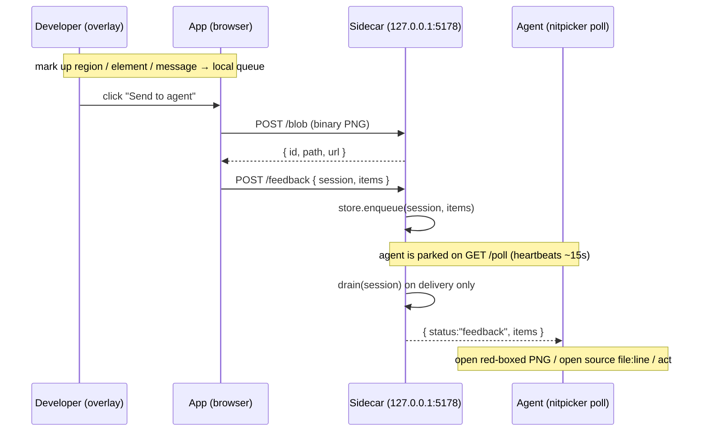

# nitpicker — Design & Architecture

This is the design report the [README](../README.md) points to. It documents the architecture of
`nitpicker` — the transport, the screenshot capture, the element-source recovery, the `@nitpicker/core`
split, and the prod-gating model — with enough detail to reason about (and safely change) the pieces.

nitpicker is an **installable Claude skill**, not an app. It drops a **dev-only, in-app feedback overlay**
into any React/Next repo so a developer can visually mark up their running app — screenshot a region
(with a red box burned in) or click-to-pick a component — and batch-send that markup to the AI coding
session, which reads it over a local long-poll and acts. The whole thing is gated to development and
leaves **zero footprint in production**.

## Table of contents

1. [Overview & goals](#1-overview--goals)
2. [Component map](#2-component-map)
3. [The three modes](#3-the-three-modes)
4. [Transport & data flow](#4-transport--data-flow)
5. [Element source recovery](#5-element-source-recovery)
6. [Prod-safety model](#6-prod-safety-model)
7. [Extension seam](#7-extension-seam)
8. [Key design decisions & tradeoffs](#8-key-design-decisions--tradeoffs)

---

## 1. Overview & goals

The problem: a developer looking at their running app and an AI session that wrote it do not share a
frame of reference. "The button in the top-right is misaligned" is lossy; a screenshot pasted into chat
loses the DOM/route context; "this component" means nothing without a file path. nitpicker closes that gap
by letting the developer point **at the running UI** and hand the agent exactly what it needs to act:

- a **region screenshot** with the selected area boxed in red and the rest dimmed, delivered as a
  **local PNG file path** (not base64 in a chat message), plus the selection rect, route, and viewport;
- an **element descriptor** that is *agent-grade* — the React component name, the source `file:line:col`,
  a stable CSS selector, testid, visible text, role, and route — enough for the agent to open or grep
  straight to the code.

Two hard contracts shape every decision below:

- **Dev-only.** The overlay, the screenshot rasterizer, the source-stamp transform, and the sidecar are
  all development tooling. None of it is part of the shipped app.
- **Zero prod footprint.** After `next build`, there must be **no** `html2canvas` in `.next/static` and
  **no** `data-nitpicker-source` attribute anywhere in the emitted output. This is a verification step, not
  an aspiration (see [§6](#6-prod-safety-model)).

A third, softer contract drives the packaging: **installs into any React/Next repo with no
hand-wiring**. That is why `@nitpicker/core` imports no React, why the sidecar uses `node:http` only, and
why the single host-specific concern (element enrichment) is funneled through one seam.

---

## 2. Component map

nitpicker is four cooperating parts. The overlay that runs in the browser, the adapter that mounts it in a
React app, the build-time transform that makes source locations recoverable, and the local sidecar the
agent talks to.

```
assets/nitpicker/
├── core/                     @nitpicker/core — framework-agnostic, shadow-DOM isolated (NO React import)
│   ├── index.ts              public entry: Nitpicker.mount() + the runtime prod backstop
│   ├── overlay.ts            the orchestrator: shadow-DOM UI, mode state machine, drag/freeze, panel
│   ├── styles.ts             all overlay CSS, injected into the shadow root (host styles can't collide)
│   ├── region.ts             region capture: rasterizeViewport (html2canvas) + annotateRegion (red box) → PNG blob + thumb
│   ├── redbox.ts             pure device-pixel compositing math (scaleRect / compositeRegion) + tests
│   ├── elements.ts           framework-agnostic element descriptor (selector/testid/text/role/rect)
│   ├── transport.ts          client to the sidecar: upload blobs, then POST the batch
│   └── types.ts              shared wire schema + serializeItem() (strips client-only fields)
│
├── react/                    the Next/React adapter (the only React-aware code)
│   ├── dev-overlay.tsx       dev-only "use client" mount; dynamic-imports core behind the NODE_ENV gate
│   └── react-source.ts       the resolveElement seam: fiber-walk component name + data-nitpicker-source
│
├── next/                     dev-only build transform (stamps source locations onto host JSX)
│   ├── nitpicker-source-plugin.cjs   Babel plugin: add data-nitpicker-source="file:line:col" to host tags
│   └── nitpicker-source-loader.cjs   bundler loader running the plugin (Turbopack + webpack)
│
├── server/                   the sidecar transport server (zero deps — node:http only)
│   ├── index.ts              HTTP endpoints: /blob, /feedback, /poll, /blob/:id, /health, /shutdown
│   ├── store.ts              in-memory per-session FIFO queue with drain-on-delivery semantics
│   └── blobs.ts              screenshot blobs written to a temp dir, referenced by id
│
├── cli/poll.ts               the agent's long-poll client (`nitpicker poll`)
└── bin/nitpicker.ts            the CLI entrypoint (serve / poll / health / shutdown)
```

| Part | Package / dir | Runs in | Depends on | Role |
| --- | --- | --- | --- | --- |
| Overlay core | `@nitpicker/core` (`core/`) | the browser (dev) | `html2canvas` (dynamic) | framework-agnostic UI + capture + descriptor + transport client, isolated in a shadow root |
| React adapter | `react/` | the browser (dev) | React (host's) + core | mounts the overlay dev-only; supplies the React `resolveElement` enrichment |
| Source stamp | `next/` | the bundler (dev) | `@babel/core` | stamps `data-nitpicker-source` onto host JSX so a click can recover `file:line:col` |
| Sidecar + CLI | `server/`, `cli/`, `bin/` | Node under `tsx` (dev) | `node:*` only | receives batches, stores blobs, serves the agent's long-poll |

The layering is strict: `core` knows nothing about React or Next; `react/` is the only React-aware code;
`next/` runs only in the bundler; `server`/`cli`/`bin` are a separate process the app never imports. The
app's *only* touchpoints are one component mount (`<NitpickerOverlay/>`) and one `next.config` merge.

---

## 3. The three modes

The dock (bottom-center, built in `overlay.ts`) is a small state machine over three modes plus a chat
panel. `setMode()` toggles a single active mode, arms/disarms the region interaction layer, and
enables/disables the element picker. `Escape` always returns to cursor (and un-freezes any frozen view);
`⌘/Ctrl+Shift+X` jumps straight into Region mode from any mode/focus, freezing the viewport at key-press
time (see Region below).

### Cursor — passive
The default. The interaction layer is `pointer-events: none`, the element picker is off — the app is
fully interactive and the overlay does nothing but show the dock. This is the "get out of the way" mode.

### Region — drag to screenshot → composited red-box PNG
Arming region mode makes the full-viewport interaction layer accept pointer events. A mousedown starts a
drag; `dragRect()` normalizes any drag direction into a positive-size rect (CSS px) and four dim "bands"
plus a dashed outline track the selection live. On mouseup (rects under 6px are discarded as accidental
clicks), `freezeAndCapture()` runs:

1. `captureRegion()` (`region.ts`) dynamically `import()`s `html2canvas` and rasterizes
   `document.body` at `scale` (default `devicePixelRatio`), excluding the overlay's own shadow host
   (both via `ignoreElements` and a `data-html2canvas-ignore` attribute — belt and braces).
2. `checkCaptureScale()` (`redbox.ts`) guards that the canvas really is `viewport × scale`; if
   html2canvas clamped the scale, the red box would land in the wrong space, so it emits a warning.
3. `compositeRegion()` paints the annotation **onto the captured canvas in true device-pixel
   coordinates**: four dim bands outside the selection and a red stroke around it. Because the selection
   was measured in CSS px, every coordinate is multiplied by the **same** `scale` used for the raster
   (not re-derived from `devicePixelRatio`, which may differ). html2canvas leaves a residual
   `ctx.scale(scale, scale)` transform it never resets, so the compositor calls `setTransform(1,0,0,1,0,0)`
   first — otherwise every coordinate would be scaled a second time and the box would land at ~2× its
   position. This is the one fiddly bit and has a dedicated unit test.
4. The composited canvas is shown fixed over the viewport to **freeze** the view, a `toBlob()` PNG and a
   small data-URL thumbnail are produced, and a queue card asks "What should change here?".

Result: a `region` queue item carrying the PNG blob (client-only, uploaded on send), a thumbnail, the
`selectionRect`, `hasRedBox: true`, plus route/pageUrl/viewport/timestamp.

**Hotkey freeze (`⌘/Ctrl+Shift+X`).** The dock path rasterizes on mouseup, which is too late for
**hover-only UI** — a chart hover-card or tooltip that vanishes the moment the cursor leaves it to reach
the dock. The hotkey solves this by splitting the timing: on key-press it arms region mode and calls
`rasterizeViewport()` **immediately**, painting the raw canvas into a `.np-snapshot` layer (ordered below
the interaction layer so the dim bands + dashed outline still draw on top during the drag) so the hovered
view is frozen. The subsequent drag then annotates *that same canvas* via `annotateRegion()` on mouseup
— it must **not** re-rasterize, since the hover state is already gone. `region.ts` is split into
`rasterizeViewport` + `annotateRegion` for exactly this (`captureRegion()` is now just the two composed
for the dock path).

### Element — hover to outline, click to record → agent-grade descriptor
Enabling element mode attaches capture-phase `mouseover`/`mouseout`/`click` listeners on `document` and
sets a crosshair cursor. Hover draws a separate highlight box over the target (the app's own styles are
never mutated — the highlight is `pointer-events: none`) labeled with the tag and any testid. A click is
**swallowed** (`preventDefault` + `stopPropagation`) so picking a submit button or link never fires the
app's handler, and `buildElementDescriptor()` runs:

- `baseDescriptor()` (`elements.ts`) builds the framework-agnostic fields: a short, mostly-stable **CSS
  selector** (≤5 levels, preferring a stable `id` → testid → stable+unique class → `:nth-of-type`), the
  nearest **testid**, **visible text** (≤240 chars, `innerText` → `textContent` → `aria-label`/`title`),
  **tag**, **role**, and **rect**.
- the host `resolveElement` seam (the React adapter) merges in **component** (fiber-walk name) and
  **source** (`file:line:col` from the stamp). See [§5](#5-element-source-recovery).

Result: an `element` queue item carrying that descriptor plus route/pageUrl/viewport/timestamp — no
image. The descriptor is deliberately agent-grade *even without React info*: selector + testid + text +
role + route are enough for an agent to grep the code.

A fourth dock button opens the **chat panel** (right side; a bottom sheet under 720px). It lists queued
marks, lets the developer add freeform `message` items, and **Send to agent** ships the whole batch.

---

## 4. Transport & data flow

The sidecar (`server/index.ts`) is a local, dev-only HTTP server on `127.0.0.1:5178` (override via
`NITPICKER_PORT`). It is deliberately shaped as a minimal, predictable long-poll transport, so the mental
model stays simple. It has **zero third-party dependencies** — `node:http` only — so nothing in it
can ever leak into the app or prod.

### Endpoints

| Method + path | Purpose |
| --- | --- |
| `POST /blob` | Raw binary screenshot upload (`X-Nitpicker-Mime` header). Writes to a temp file, returns `{ id, path, url, bytes }`. Keeps images out of the poll JSON. |
| `POST /feedback` | Enqueue one item or a batch `{ session, items:[…] }`. Accepts a bare single item too. Returns `{ ok, queued }`. |
| `GET /poll` | The agent's long-poll. **Drains** the session queue and returns `{ status:"feedback", items }`; otherwise parks the request until the next enqueue, sending ~15s heartbeat whitespace to keep the socket alive. `timeoutMs` bounds it (0 = indefinite). |
| `GET /blob/:id` | Serve a stored blob by id (fallback to the local `path` each item already carries). Validates the id is a UUID before touching the filesystem. |
| `GET /health` | Liveness: `{ ok:true, service:"nitpicker-sidecar" }`. |
| `POST /shutdown` | Stop the process. |

### Session identity
A session is a **caller-supplied string** (a project/session id), never a file path. The app mounts with
one (`NEXT_PUBLIC_NITPICKER_SESSION`, default `"nitpicker"`) and the agent polls with the same value. Each
session owns an independent FIFO queue, so several apps + agents can share one sidecar without crosstalk.

### Blobs never travel as base64
Region PNGs are uploaded as **binary** to `POST /blob` *before* the batch is sent; the returned `id` /
`path` / `url` are inlined into the item's `image` field, and `serializeItem()` strips the client-only
`_blob`/`_thumb` before anything goes on the wire. The agent then reads the PNG straight off the local
file path. This keeps the poll JSON small and avoids ~33% base64 inflation of every screenshot.

### The drain guarantee
The queue is cleared by **`drain()` and nothing else** (`store.ts`), and the poll handler only drains
**when it can actually deliver** — i.e. the socket is still writable. If the poll is killed before a batch
arrives, the `req.on("close")` teardown unsubscribes **without draining**, so the items stay queued for
the next poll. The result: feedback is delivered **exactly once** and a killed/re-issued poll never loses
it. The developer can hit Send before the agent's poll is even running; the batch simply waits.

### Sequence



The CLI client (`cli/poll.ts`) issues the `GET /poll`, accumulates the response (heartbeat whitespace is
harmless — `JSON.parse` ignores leading spaces), prints the batch (text + local image path + element
JSON) and exits. `--watch` loops; `--timeoutMs` bounds a single poll.

---

## 5. Element source recovery

The hardest part of element mode is answering "which source file is this?" from a runtime DOM click.

**Component name** is recoverable at runtime. `react-source.ts` reads the React fiber off the DOM node
via the well-known `__reactFiber$<hash>` (or `__reactInternalInstance$<hash>`) key, then climbs
`_debugOwner` (the JSX owner whose source contains the element) then `return` to the nearest **useful**
named function/class component — unwrapping `forwardRef`/`memo` and skipping noise like `Fragment`,
`Suspense`, `Provider`/`Consumer`. This is reliable in dev.

**Source `file:line:col` is not recoverable at runtime on React 19.** React ≤18 exposed `_debugSource`
on the fiber; **React 19 removed it**. So a runtime click can no longer recover a source location on its
own. nitpicker solves this the way "click-to-component" tooling converged on: a **build-time stamp**. The
dev-only Babel plugin (`nitpicker-source-plugin.cjs`) visits every `JSXOpeningElement` and, for **host tags
only** (lowercase — `<div>`, `<button>`, `<tr>`), appends `data-nitpicker-source="path:line:col"` (a stable
POSIX-relative path). Component JSX (`<Foo/>`, `<Foo.Bar/>`, fragments, namespaced/member names) is
**skipped** on purpose: the fiber walk already yields the component name, and we only need the stamp to
locate the concrete host DOM node the developer clicked. At pick time, `sourceOf()` reads the attribute
off the node or its nearest ancestor carrying it.

The loader (`nitpicker-source-loader.cjs`) runs that plugin over app `.tsx`/`.jsx` under both bundlers (see
[§6](#6-prod-safety-model) and [§8](#8-key-design-decisions--tradeoffs) for why it is one plain loader and
why it loads Babel via dynamic `import()`).

**Graceful degradation.** Every React lookup is best-effort and wrapped in `try/catch` so fiber
archaeology can never break the picker. If the fiber can't be read, `component` is absent; if the stamp is
missing (loader not wired, a `.jsx` file not matched, a file that failed to parse and passed through
unstamped), `source` is absent. The descriptor still carries selector + testid + text + role + rect +
route — which the SKILL's agent guidance treats as the fallback grep path. Nothing about element mode
*requires* React to be present at all; the React fields are pure enrichment over the core base.

---

## 6. Prod-safety model

Prod-safety is defense in depth: several independent gates, any one of which would keep nitpicker out of
production, plus two backstops. The **primary** gates are the two the installer wires in.

**Gate 1 — the layout mount guard + co-located dynamic import.** The root layout renders `<NitpickerOverlay/>`
only behind `process.env.NODE_ENV !== "production"`, and inside `NitpickerOverlay`'s effect the
`import("../core")` / `import("./react-source")` calls sit **inside the same static guard**. Under
`next build`, `process.env.NODE_ENV` is statically `"production"`, so webpack folds the branch to
`if (false) {…}` and eliminates it **together with its import chain** — the async chunk carrying core +
html2canvas is never emitted. (Using a dynamic `import()` rather than a static one also keeps the
overlay's weight out of the initial page bundle even in dev.) This is why the guard must stay a static
`!==` literal and must not become a runtime-only check — the literal is what lets the bundler drop the
branch.

**Gate 2 — the `isDev`-gated `next.config` wiring.** The source-stamp loader is added to Turbopack's
rules and webpack's module rules only when `NODE_ENV !== "production"`. So `next build` adds no loader and
stamps no `data-nitpicker-source` attribute anywhere. (Two sharp edges live here: the loader loads
`@babel/core` via dynamic `import()` because Babel 8 is ESM-only, and the Next 16 config requires an empty
`turbopack: {}` key to coexist with a `webpack` function.)

**Gate 3 — process isolation.** The sidecar and CLI are a separate Node process run under `tsx`. The app
**never imports them**, so they cannot end up in any app bundle regardless of the gates above.

**Backstop A — the runtime `mount()` bail** (`core/index.ts`). `Nitpicker.mount()` re-checks
`NODE_ENV === "production"` and, if true, logs a warning and returns a **no-op handle** that never
constructs the `Overlay` (no DOM host, no listeners). By the time this runs the dev-only code has already
shipped, so it does **not** replace Gates 1–2 — it is the belt to their suspenders, refusing to actually
build the overlay if a misconfigured install slips the static gate. The `typeof process` probe is
mandatory: core is framework-agnostic and may run in a plain browser with no bundler `process` define,
where a bare `process.env` reference would throw.

**Backstop B — the `nitpicker verify` build-scan.** The `nitpicker verify` subcommand (`bin/nitpicker.ts
verify`, `cli/verify.ts`) codifies the manual prod-safety check into the CLI: after `next build`, assert that
`grep -r html2canvas .next/static` and `grep -r data-nitpicker-source .next` (excluding `cache`/`dev`) both
come back empty. It is a backstop, not a gate — it *catches* a leak rather than *preventing* one — but it
turns the contract into something CI can enforce.

---

## 7. Extension seam

nitpicker is built to grow along exactly one axis: **how a picked element is enriched**. Core supplies the
framework-agnostic base descriptor; the host plugs in a single function:

```ts
resolveElement?: (el: Element) => Partial<ElementDescriptor>;
```

`buildElementDescriptor()` calls `baseDescriptor(target)` and merges the host result over it. This repo
ships **one** implementation of the seam — `resolveReactElement` (the React/Next adapter). Everything
React-specific lives behind it; core stays framework-agnostic. Adding support for another framework's
component/source recovery is "write another `resolveElement`", nothing more.

The **anticipated (not shipped)** extension is an **iframe-harness adapter** for apps nitpicker doesn't
own the source of — e.g. Streamlit or other non-React/non-owned apps rendered in an iframe. There the
overlay would run in a harness frame around the target rather than mounted inside it, and `resolveElement`
would degrade to the framework-agnostic base (selector/testid/text/role/rect) since there is no fiber to
walk and no build step to stamp. The seam and the "agent-grade without React" base descriptor are shaped
with this in mind, but the adapter is explicitly out of scope for the current skill.

---

## 8. Key design decisions & tradeoffs

**Shadow-DOM isolation.** The overlay mounts on a `data-nitpicker` host with an open shadow root, and all
CSS (`styles.ts`) is injected inside it behind `:host { all: initial; }`. Host page styles can never
collide with the overlay's and vice-versa — critical for a tool that must drop into *any* repo's styling.
The picker never mutates the app's own element styles either; hover highlighting is a separate
`pointer-events: none` overlay rect. Tradeoff: shadow retargeting means the picker must recognize its own
host (`pickTarget` returns null for it) so the overlay UI is never itself "picked".

**Zero-dependency sidecar (`node:http` only).** No Express, no ws. A transport with no third-party deps
can never contribute to the app's dependency graph, keeps the install trivial (`tsx` runs it with no
build step), and keeps the security surface minimal for something that binds a local port. Tradeoff: we
hand-roll body reading, CORS, and the long-poll — a few dozen lines, but they are ours to maintain.

**html2canvas + self-composited annotation for exact device-pixel accuracy.** Screenshots use
`html2canvas` (a DOM rasterizer) rather than the browser's `getDisplayMedia`, so there is **no permission
prompt** and no capture of anything outside the page. html2canvas' raster is approximate, but the
annotation must be exact — so nitpicker composites the red box and gray dim **itself**, in true device-pixel
space, at the same `scale` used for the raster (`redbox.ts`). Even where the underlying pixels are
approximate, the box is always precisely where the developer dragged. The `checkCaptureScale()` guard and
the explicit `setTransform` reset defend the one place this math can go wrong. Tradeoff: html2canvas can
mis-render exotic CSS; the annotation accuracy is unaffected, and the selection rect travels alongside the
image so the agent always knows the exact region regardless.

**Long-poll over WebSockets.** The agent consumes feedback with a plain `GET /poll` (heartbeat whitespace
keeps the socket warm, `JSON.parse` ignores it). A long-poll composes naturally with how an AI session
runs a CLI as a background task — run `nitpicker poll`, block until a batch arrives, print it, exit (or
`--watch`). Combined with drain-on-delivery, a killed poll simply re-runs and the queue is intact. A
WebSocket would add a stateful connection, a reconnection protocol, and framing for no benefit to this
consumption model. Tradeoff: no server-push to the *browser* — but the browser is the producer here, not
the consumer, so none is needed.

**Blobs to a temp file, referenced by id (never base64 in JSON).** Images are uploaded binary and land as
a local file the agent opens directly; the poll JSON carries only an `id`/`path`/`url`. This avoids
base64 inflation, keeps the batch JSON readable, and matches how an agent actually wants an image — as a
file path for its image-reading tool, not an inline string.

**Build-time source stamp over runtime recovery.** React 19 removing `_debugSource` forced this: a
runtime click can recover a component *name* (fiber) but not a source *location*. Stamping host JSX at
build time is the durable fix. It is dev-only and host-tags-only so it costs nothing in prod and adds no
attributes to component elements. Tradeoff: it requires the `next.config` wiring, and a `.tsx`-only rule
misses `.jsx` — both are called out in the SKILL, and the descriptor degrades gracefully when the stamp
is absent.
